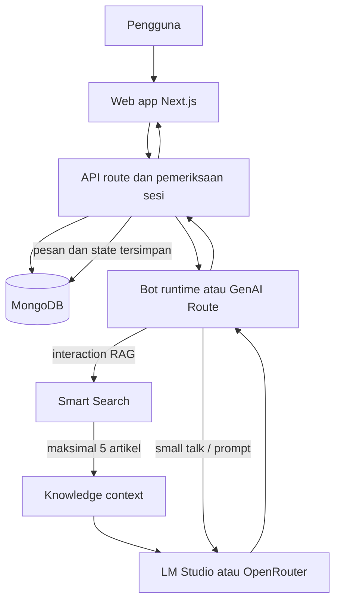

# GenAI Chatbot & AI Agent Platform

Aplikasi web untuk mengelola chatbot berbasis AI. Admin dapat menyusun alur percakapan, mengelola Knowledge Base, mengatur prompt dan provider AI, serta melihat riwayat percakapan. Sistem menggabungkan alur yang deterministik dengan generasi jawaban oleh Large Language Model (LLM).

README ini juga merangkum konsep dan alur sistem sebagai bahan penjelasan proyek.

## Ringkasan Proyek

Chatbot generatif dapat memberi jawaban yang lancar, tetapi jawaban dapat tidak sesuai dengan informasi yang dimiliki organisasi. Di sisi lain, alur percakapan statis sulit menangani pertanyaan bebas. Proyek ini menggabungkan kedua pendekatan: alur yang dirancang pengelola untuk menjaga proses tetap terarah, serta AI generatif untuk menangani percakapan dan menyusun jawaban.

**Tujuan:** menyediakan dashboard agar pengelola dapat membuat chatbot, mengisi sumber pengetahuan, memilih alur dan prompt, lalu menguji percakapan tanpa perlu mengubah kode untuk setiap bot.

**Pengguna:** admin mengelola seluruh sistem; manager mengelola fitur operasional yang diizinkan; public user menggunakan chatbot dan melihat percakapannya sendiri.

## Fitur

- Autentikasi, pengelolaan pengguna, dan kontrol akses berbasis peran.
- Chatbot builder dengan interaction seperti welcome message, guided routing, tanya-jawab, small talk, RAG, web search, dan data collection.
- Data collection bertahap yang menyimpan jawaban sebagai state percakapan dan dapat digunakan oleh langkah berikutnya.
- Knowledge Base terpisah, input artikel manual, dan impor CSV.
- Smart Search yang memberi skor relevansi artikel dan mengambil maksimal lima artikel teratas sebagai konteks AI.
- Pengelolaan prompt, flow dialog, skill, dan reusable component.
- Riwayat percakapan dan informasi sumber artikel yang cocok.
- Pilihan provider AI: LM Studio untuk server yang dapat dijangkau aplikasi, atau OpenRouter untuk model cloud.

## Konsep AI

### Smart Search dan RAG

Untuk interaction RAG, sistem menjalankan pencarian sebelum meminta model menghasilkan jawaban:

1. Query dinormalisasi menjadi huruf kecil dan tanda baca dibersihkan.
2. Query dipecah menjadi token dan kata umum (stop words) disaring.
3. Token dicocokkan dengan judul, tag, kategori, ringkasan, detail, konten, serta field teks tambahan pada artikel.
4. Sistem memberi bobot pada kecocokan, mengurutkan artikel berdasarkan skor, lalu memilih maksimal lima artikel.
5. Artikel terpilih disusun menjadi knowledge context dan dikirim bersama pertanyaan ke LLM.
6. Jawaban, skor, dan artikel terkait disimpan atau ditampilkan dalam percakapan.

Ini merupakan pola **Retrieval-Augmented Generation (RAG)**: informasi diambil dari Knowledge Base terlebih dahulu, kemudian digunakan model sebagai konteks. Retrieval dalam implementasi ini adalah pencarian leksikal dengan scoring berbobot, **bukan** embedding atau vector database. Karena itu, hasil pencarian bergantung pada kemiripan kata dan kualitas artikel.

### Generasi dan routing

- **Flow bot:** runtime mengikuti interaction dan transisi yang disusun pengelola. Guided Routing dapat memakai provider/model global atau dipilih khusus pada node tersebut. Interaction tertentu memanggil AI, Smart Search, atau web search; interaction lain memberi respons tetap atau mengumpulkan data.
- **GenAI Route:** pada mode chat tanpa flow bot, prompt route mengklasifikasikan pesan menjadi `SMALL_TALK` atau `FAQ`. Kategori tersebut menentukan prompt dan langkah respons berikutnya.
- **LLM:** proyek tidak melatih model sendiri. Aplikasi mengirim permintaan ke provider yang dipilih dan menerima teks jawaban. Kunci API disimpan sebagai environment variable server, bukan di browser.

## Arsitektur dan Alur Data



Next.js menangani antarmuka dan API. API memvalidasi sesi pengguna, membaca atau memperbarui data di MongoDB, menjalankan flow dan pencarian, lalu memanggil provider AI bila interaction membutuhkannya. Riwayat pesan, state flow, dan jawaban data collection dapat disimpan pada dokumen conversation.

## Teknologi

| Bagian | Teknologi |
|---|---|
| Web dan API | Next.js 16, React 19, TypeScript |
| Styling | Tailwind CSS 4 |
| Database | MongoDB dan MongoDB Node.js Driver |
| Autentikasi | JWT dengan cookie HttpOnly; bcrypt untuk password |
| Chat completion | LM Studio atau OpenRouter |
| Import CSV | Papa Parse |
| Visual flow | React Flow (`@xyflow/react`) |
| Hosting | Vercel (opsional) |

## Struktur Data

Database yang digunakan aplikasi bernama `aiChatbot`. MongoDB bersifat fleksibel; collection dapat dibuat saat dokumen pertama dimasukkan.

| Collection | Kegunaan |
|---|---|
| `users` | Identitas pengguna, role, dan password hash |
| `bots` | Definisi bot, daftar interaction, posisi node, dan transisi |
| `botSettings` | Referensi bot aktif |
| `conversations` | Pemilik percakapan, pesan, message count, dan state bot |
| `knowledgeBases` | Metadata Knowledge Base dan nama collection artikelnya |
| `kb_<slug>` | Artikel untuk masing-masing Knowledge Base; nama dibuat dinamis |
| `prompts` | Template prompt berdasarkan jenisnya |
| `genaiConfig` | Provider dan parameter generasi yang dipilih |
| `skills` | Skill yang menghubungkan user bot dengan bot flow |
| `components` | Template tombol, kartu, carousel, dan referensi artikel |
| `flowDialogs` | Flow dialog yang disimpan sebagai nodes dan edges |
| `knowledgeBase` | Collection artikel lama untuk kompatibilitas endpoint terdahulu |

Dokumen memakai `_id` ObjectId bawaan MongoDB serta timestamp seperti `createdAt` dan `updatedAt`. Collection Knowledge Base dinamis memungkinkan tiap basis pengetahuan dipisahkan dari basis lainnya.

## Keamanan dan Batasan

- Endpoint terlindungi memeriksa sesi dan role pengguna.
- Password pengguna di-hash sebelum disimpan. Token sesi disimpan dalam cookie HttpOnly.
- `MONGODB_URI`, `JWT_SECRET`, dan `OPENROUTER_API_KEY` adalah rahasia server. Jangan commit `.env.local` atau menuliskan nilai rahasia ke README.
- `localhost` pada `LM_STUDIO_URL` hanya menunjuk ke mesin yang menjalankan aplikasi. Untuk deployment Vercel, gunakan provider cloud atau alamat LM Studio yang dapat dijangkau server.
- Smart Search berbasis kata, bukan pemahaman semantik. Pertanyaan dengan istilah berbeda dari artikel dapat memperoleh skor rendah.
- Kualitas jawaban RAG dibatasi oleh kualitas dan cakupan Knowledge Base serta model/provider yang digunakan.
- Provider AI eksternal dapat memiliki batas pemakaian, latensi, atau perubahan ketersediaan model.

## Menjalankan Secara Lokal

Prasyarat: Node.js, npm, dan MongoDB yang dapat dijangkau dari komputer.

1. Install dependency:

	```bash
	npm ci
	```

2. Buat `.env.local` di root proyek. Isi dengan nilai milikmu sendiri; jangan gunakan placeholder sebagai kredensial nyata:

	```dotenv
	MONGODB_URI=mongodb+srv://<user>:<password>@<cluster>/<database-options>
	JWT_SECRET=<random-secret-strong>
	AI_PROVIDER=openrouter
	OPENROUTER_API_KEY=<api-key>
	OPENROUTER_MODEL=openrouter/free
	NEXT_PUBLIC_APP_NAME=GenAI Chatbot Dashboard
	NEXT_PUBLIC_APP_URL=http://localhost:3000
	```

	`OPENROUTER_MODEL`, `NEXT_PUBLIC_APP_NAME`, dan `NEXT_PUBLIC_APP_URL` memiliki default, tetapi sebaiknya diatur untuk deployment. Jika memakai LM Studio secara lokal, pilih `AI_PROVIDER=lmstudio` dan sesuaikan `LM_STUDIO_URL` serta `LM_STUDIO_MODEL`.

3. Jalankan aplikasi:

	```bash
	npm run dev
	```

	Buka `http://localhost:3000`.

Perintah lain:

```bash
npm run build
npm run start
npm run lint
```

`npm run seed` menambahkan data contoh untuk pengembangan/demo. Tinjau `scripts/seed.mjs` sebelum menjalankannya dan jangan gunakan akun atau data seed sebagai konfigurasi produksi.

## Deployment ke Vercel

1. Import repository GitHub sebagai project Next.js. Root Directory harus menunjuk ke folder yang berisi `package.json`.
2. Tambahkan environment variables di Vercel untuk Production dan Preview: `MONGODB_URI`, `JWT_SECRET`, `AI_PROVIDER`, dan `OPENROUTER_API_KEY` jika memakai OpenRouter. Atur model dan URL aplikasi bila diperlukan.
3. Gunakan MongoDB Atlas atau MongoDB yang dapat dijangkau dari Vercel; jangan gunakan URI localhost.
4. Deploy, periksa build log, lalu uji login, pembuatan percakapan, Knowledge Base, serta respons AI.

## Panduan Presentasi

### Narasi singkat

> “Proyek saya adalah platform chatbot GenAI yang dapat dikonfigurasi melalui dashboard. Pengelola dapat menyusun flow percakapan dan Knowledge Base, sedangkan pengguna berinteraksi melalui chat. Untuk pertanyaan berbasis pengetahuan, sistem melakukan Smart Search, memberi skor pada artikel, dan hanya mengirim maksimal lima artikel paling relevan sebagai konteks ke model AI. Dengan cara ini, model dibantu oleh data proyek, bukan diminta menjawab dari pertanyaan saja. Sistem juga mendukung flow deterministik, pengumpulan data bertahap, riwayat percakapan, dan pilihan provider AI. Retrieval saat ini menggunakan pencocokan kata berbobot, belum menggunakan embedding atau vector database.”

### Urutan demo yang disarankan

1. Login dan tunjukkan dashboard serta pembagian role.
2. Buka Knowledge Base dan tunjukkan artikel yang menjadi sumber jawaban.
3. Tunjukkan bot flow: interaction, koneksi antar-node, atau data collection.
4. Mulai percakapan dan ajukan pertanyaan yang jawabannya ada di artikel.
5. Jelaskan bahwa sistem memilih maksimal lima artikel, lalu model menyusun jawaban dengan konteks tersebut.
6. Tunjukkan riwayat percakapan dan, bila tersedia, artikel yang cocok.

### Pertanyaan yang mungkin ditanyakan

**Apa bagian AI dalam proyek ini?**

Model LLM menghasilkan respons dan dapat membantu routing pertanyaan. Smart Search mengambil informasi relevan dari Knowledge Base sebelum respons RAG dibuat.

**Apakah proyek melatih model sendiri?**

Tidak. Proyek mengintegrasikan model yang disediakan LM Studio atau OpenRouter. Fokus implementasi adalah orkestrasi percakapan, retrieval, prompt, dan integrasi data.

**Mengapa konteks dibatasi lima artikel?**

Agar hanya informasi yang paling relevan dikirim sebagai konteks, mengurangi data yang tidak berkaitan, dan menjaga ukuran prompt tetap terkendali. Batasnya dapat diubah di kode.

**Apakah sudah memakai vector database atau embedding?**

Belum. Retrieval menggunakan normalisasi query, tokenisasi, stop words, pencocokan beberapa field artikel, dan scoring berbobot. Ini lebih sederhana, mudah dijelaskan, dan menjadi batasan untuk pencarian semantik.

**Bagaimana mengurangi jawaban yang mengarang?**

Pertanyaan RAG diberi konteks artikel dan instruksi untuk menjawab berdasarkan konteks. Namun, pendekatan ini tidak menjamin jawaban selalu benar; hasil tetap perlu diuji terhadap kualitas data dan perilaku model.

## Pengembangan Lanjutan

- Mengukur kualitas retrieval dengan kumpulan query dan artikel berlabel.
- Membandingkan pencarian berbobot saat ini dengan embedding/vector search.
- Menambah sitasi sumber yang konsisten dan evaluasi jawaban berbasis konteks.
- Menambah logging, pemantauan latensi, serta penanganan batas pemakaian provider.
- Memperkuat validasi input, kebijakan retensi data, dan pengelolaan secret untuk deployment.

## Referensi Implementasi

- [Smart Search](src/lib/smart-search.ts)
- [AI provider dan completion](src/lib/ai.ts)
- [Bot runtime](src/lib/bot-runtime.ts)
- [Pemrosesan pesan conversation](src/app/api/conversations/[id]/messages/route.ts)
- [MongoDB connection](src/lib/mongodb.ts)
