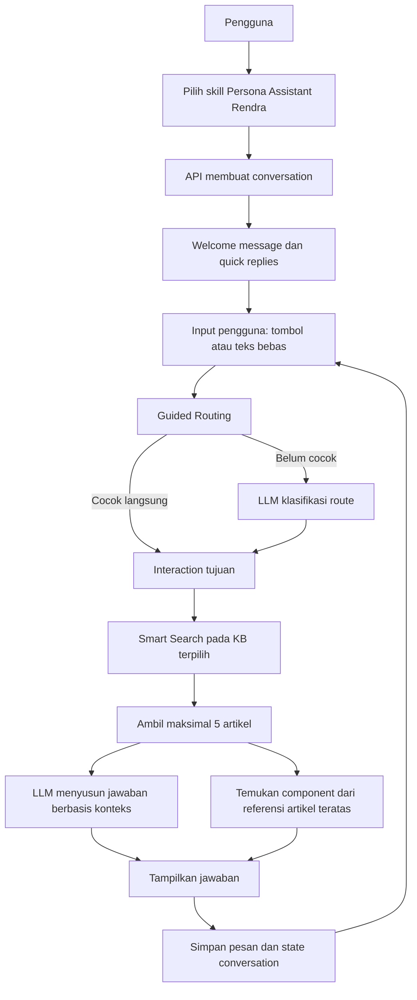

# Audit Arsitektur Persona Assistant Rendra

Dokumen ini menjelaskan Persona Assistant Rendra dari sudut pandang alur pengguna, arsitektur bot, retrieval Knowledge Base, dan komponen UI. Fokusnya adalah cara sistem memilih jalur dan menyusun jawaban, bukan penjelasan seluruh platform.

## Ringkasan

Persona Assistant Rendra adalah chatbot informasional tentang profil, pendidikan, keterampilan, pengalaman, organisasi, dan proyek Rendra. Pengguna dapat memilih topik melalui tombol atau menyampaikan pertanyaan bebas. Untuk pertanyaan faktual, flow dapat meneruskan pertanyaan ke Knowledge Base; model AI menyusun jawaban dari artikel yang ditemukan.

**Tujuan desain:** memisahkan pengarah percakapan, pencarian sumber informasi, generasi jawaban, dan komponen presentasi. Pemisahan ini membuat isi pengetahuan dapat diperbarui tanpa menulis ulang logika percakapan, sementara jalur bot dapat diedit melalui Bot Flow Editor.

**Batas audit:** definisi bot dan relasi skill disimpan di MongoDB, bukan sebagai graph statis di repository. Karena konfigurasi dapat berubah, dokumen ini menjelaskan perilaku runtime dan konfigurasi komponen yang dikelola oleh script repository. Untuk audit satu deployment tertentu, cocokkan juga dokumen bot, skill, prompt, dan Knowledge Base yang aktif di database.

## Narasi Presentasi

> “Persona Assistant Rendra adalah chatbot berbasis flow yang menjawab pertanyaan tentang Rendra. Pengguna memilih skill untuk menentukan persona dan bot flow, lalu dapat memilih topik atau mengetik pertanyaan. Guided Routing menentukan interaction tujuan. Untuk pertanyaan faktual, Smart Search mengambil maksimal lima artikel dari Knowledge Base yang dipilih; konteks tersebut diberikan kepada LLM agar model merangkai jawaban. Jika artikel teratas memiliki komponen yang ditautkan, chatbot juga menampilkan tombol, kartu, atau carousel yang relevan.”

## User Flow

1. **Memilih persona.** Pengguna membuka Chatbot dan memilih skill Persona Assistant Rendra. Skill menghubungkan identitas user bot dengan satu bot flow.
2. **Memulai percakapan.** Saat percakapan baru dibuat, API menyimpan `botId` dan `skillId`, lalu runtime menginisialisasi entry interaction dan pesan pembuka.
3. **Melihat menu topik.** Welcome message memperkenalkan asisten dan menyediakan quick reply. Menu yang terlihat pada contoh UI mencakup Profil Rendra, Pendidikan, Keahlian, Pengalaman, dan Proyek.
4. **Memilih topik atau bertanya bebas.** Klik reply mengirim nilai tombol sebagai pesan pengguna. Pertanyaan bebas mengikuti jalur yang sama.
5. **Menentukan interaction tujuan.** Guided Routing terlebih dahulu mencocokkan input dengan label atau variable route. Jika belum cocok, model AI diminta mengklasifikasikan input ke salah satu route yang valid.
6. **Mengambil informasi.** Untuk jalur RAG, runtime mencari artikel pada Knowledge Base yang dipilih dalam konfigurasi interaction. Sistem menyusun konteks dari maksimal lima artikel dengan skor tertinggi.
7. **Menyusun jawaban.** LLM menerima pertanyaan pengguna dan knowledge context, lalu menghasilkan jawaban. Artikel yang ditemukan tetap tersedia sebagai metadata debug retrieval; daftar artikel bukan jawaban pengganti model.
8. **Menampilkan komponen terkait.** Jika artikel dengan skor tertinggi memiliki reusable component yang aktif dan tertaut, component tersebut ditampilkan bersama jawaban.
9. **Melanjutkan percakapan.** Jawaban tombol reply menjadi pertanyaan lanjutan; link button membuka sumber eksternal. Pesan dan state interaction disimpan pada conversation.

## Arsitektur Bot

### 1. Skill dan pemilihan bot

Skill adalah lapisan pemilihan persona. Dokumen skill menyimpan relasi ke user bot dan `botId`. Ketika pengguna membuat conversation dengan skill terpilih, API membaca relasi itu, memuat definisi bot, dan menyimpan `botId` serta `skillId` pada conversation. Dengan begitu, percakapan berikutnya tetap memakai bot yang dipilih, bukan bergantung pada bot aktif global.

### 2. Flow sebagai state machine

Bot didefinisikan sebagai kumpulan interaction, entry interaction, konfigurasi per node, posisi canvas, dan `nextAction`. Runtime menyimpan `currentInteractionId`, status bot, serta state Data Collection pada conversation. Setiap pesan baru diproses oleh node yang sedang aktif, lalu runtime menentukan node atau status berikutnya.

Jenis interaction yang relevan untuk persona:

| Interaction | Tanggung jawab |
|---|---|
| Welcome Message | Menampilkan sapaan, pengantar, dan quick reply. Variabel seperti `{fullName}` dapat dipakai pada teks. |
| Guided Routing | Memilih route berdasarkan kecocokan input atau klasifikasi LLM. Setiap route menunjuk ke target interaction. |
| RAG | Mencari artikel pada koleksi KB yang dipilih, mengirim konteks dan pertanyaan ke LLM, lalu mengembalikan jawaban. |
| Small Talk | Menghasilkan respons percakapan nonfaktual menggunakan instruksi/prompt interaction. |
| Data Collection | Mengumpulkan jawaban berurutan dan menyimpan jawabannya sebagai state conversation. |
| Data Collection Submitted | Opsional: menyimpan field yang dipilih pada node ke capture yang terikat ke bot. Node ini hanya berjalan jika ditambahkan ke flow. |

Graph aktual disimpan dalam collection `bots`. Karena itu, urutan target Guided Routing dan KB yang digunakan harus dibaca dari konfigurasi bot deployment saat audit; nama node atau route dapat diedit tanpa perubahan source code.

### 3. Retrieval dan generasi jawaban

RAG pada Persona Assistant menggunakan Smart Search berbasis pencocokan teks dan scoring berbobot, bukan embedding atau vector database.

1. Pertanyaan dinormalisasi dan ditokenisasi.
2. Token dibandingkan dengan field artikel, termasuk judul, ringkasan, konten, kategori, tags, dan field teks tambahan.
3. Artikel yang cocok diurutkan berdasarkan skor; runtime membatasi konteks hingga lima artikel.
4. Konteks tersebut digabungkan dengan instruksi RAG dan pertanyaan pengguna.
5. LLM menghasilkan jawaban dalam bahasa natural. Jika generasi gagal atau kosong, runtime mencoba sekali lagi; jika tetap gagal, pengguna menerima pesan kegagalan yang ramah.
6. Metadata artikel terpilih digunakan untuk Debug Retrieval dan pencocokan komponen.

Pencarian menyediakan bukti/konteks bagi model, bukan membuat jawaban final dengan menampilkan ranking artikel. Kualitas jawaban tetap bergantung pada relevansi artikel, prompt, dan provider/model AI.

### 4. Data percakapan dan batas tanggung jawab

Conversation menyimpan pemilik, pesan, `botId`, `skillId`, message count, status, current interaction, dan state pengumpulan data bila digunakan. LLM tidak memilih Knowledge Base secara bebas: koleksi pencarian berasal dari konfigurasi interaction RAG. Guided Routing menentukan jalur, sedangkan RAG menjalankan retrieval dan generasi.

Node Data Collection Submitted adalah kemampuan platform, bukan bukti bahwa Persona Assistant selalu mengumpulkan atau menyimpan data kontak. Capture hanya terjadi bila node tersebut dipasang di flow dan field-nya dikonfigurasi. Audit perlu memeriksa graph bot aktif untuk memastikan node itu memang digunakan.

## Komponen UI yang Terhubung ke Knowledge Base

Reusable component tidak dipilih secara manual oleh LLM. Template component menyimpan `articleRefs` yang menunjuk ke artikel Knowledge Base. Setelah RAG menemukan artikel teratas, runtime mencari component aktif yang mereferensikan artikel tersebut dan menampilkannya bersama jawaban. Jadi, isi jawaban berasal dari LLM dengan konteks artikel, sedangkan component menyediakan elemen interaksi/presentasi.

Script [update-rendra-components.mjs](scripts/update-rendra-components.mjs) mendefinisikan 20 template yang ditautkan ke 50 artikel pada collection `kb_rendra_personal_information_v1`. Script memvalidasi cakupan artikel dan memakai mode dry-run secara default; perubahan database hanya dilakukan ketika dijalankan dengan `--apply`.

| Jenis | Jumlah template pada definisi script | Peran |
|---|---:|---|
| Reply Buttons | 4 | Tombol berisi pertanyaan lanjutan; klik mengirim pertanyaan itu ke chat. |
| Link Buttons | 6 | Tombol yang membuka URL referensi eksternal, misalnya dokumentasi resmi. |
| Card | 5 | Satu ringkasan visual dengan judul, deskripsi, gambar opsional, dan tombol. |
| Carousel | 5 | Beberapa card dalam satu komponen untuk menyajikan kumpulan subtopik. |

Contoh kelompok konten yang dicakup template: profil dan pendidikan; web development, backend, dan database; AI/Generative AI; pengalaman PUPR dan Conversation AI; organisasi dan prestasi; portfolio; serta AI Agent computer vision dan pose recognition. Daftar dan isi aktual harus diverifikasi terhadap KB yang aktif.

### Perbedaan quick reply dan component artikel

- **Quick reply welcome** adalah bagian konfigurasi Welcome Message dan tersedia sebelum retrieval.
- **Reusable component** dicari setelah RAG menemukan artikel yang cocok; kemunculannya bergantung pada artikel pemicu dan component aktif.
- **Reply Button** mengirim teks sebagai pesan; **Link Button** menavigasi ke URL. Keduanya sama-sama tombol secara visual, tetapi aksi runtime-nya berbeda.

## Ringkasan Data Audit

| Data | Lokasi penyimpanan / sumber |
|---|---|
| Definisi bot, node, route, dan target | MongoDB `bots` |
| Relasi persona ke bot flow | MongoDB `skills` |
| Conversation, pesan, dan state flow | MongoDB `conversations` |
| Artikel persona | Knowledge Base terdaftar; script komponen merujuk `kb_rendra_personal_information_v1` |
| Template UI dan pemicu artikel | MongoDB `components`, dengan `articleRefs` ke artikel KB |
| Konfigurasi model/provider | `genaiConfig`, environment server, dan konfigurasi interaction sesuai jalur |

## Batasan dan Hal yang Perlu Ditunjukkan Saat Presentasi

- Guided Routing dibatasi ke daftar route yang dikonfigurasi. Jika model mengembalikan label yang tidak dikenal, fallback Guided Routing digunakan.
- Smart Search bersifat lexical; kata berbeda dari yang ada di artikel dapat menghasilkan relevansi rendah.
- LLM dapat merangkum atau menyusun ulang konteks, tetapi bukan pengganti verifikasi data sumber.
- Perubahan isi KB dan komponen dapat mengubah jawaban/elemen yang tampil tanpa mengubah graph bot.
- Komponen yang ditautkan ke artikel teratas dapat muncul berdasarkan hasil retrieval; tidak semua hasil Top 5 otomatis memiliki component.
- Konfigurasi bot aktif berada di database, sehingga README ini tidak mengunci snapshot node live. Simpan export/versi graph terpisah jika audit membutuhkan reproduksibilitas.

## Checklist Demo

1. Pilih skill Persona Assistant Rendra dan tunjukkan welcome serta quick reply.
2. Klik satu topik lalu tunjukkan bahwa pilihan menjadi input percakapan.
3. Ajukan pertanyaan bebas yang jawabannya tersedia di KB.
4. Jelaskan perbedaan route, retrieval Top 5, dan jawaban akhir LLM.
5. Buka Debug Retrieval untuk memperlihatkan artikel sumber tanpa menjadikannya isi jawaban.
6. Tunjukkan satu Reply Button, Link Button, Card, dan Carousel yang tertaut ke artikel.
7. Akhiri dengan batasan pencarian lexical dan tunjukkan bahwa graph bot dapat diaudit melalui Bot Flow Editor.

## Referensi Implementasi

- [Pembuatan conversation dan resolusi skill](src/app/api/conversations/route.ts)
- [Pemrosesan pesan conversation](src/app/api/conversations/[id]/messages/route.ts)
- [Runtime interaction, routing, RAG, dan component](src/lib/bot-runtime.ts)
- [Smart Search dan scoring artikel](src/lib/smart-search.ts)
- [Definisi dan validasi bot flow](src/lib/bot-flows.ts)
- [Struktur component dan validasi referensi](src/lib/component-templates.ts)
- [Script template komponen Persona Rendra](scripts/update-rendra-components.mjs)